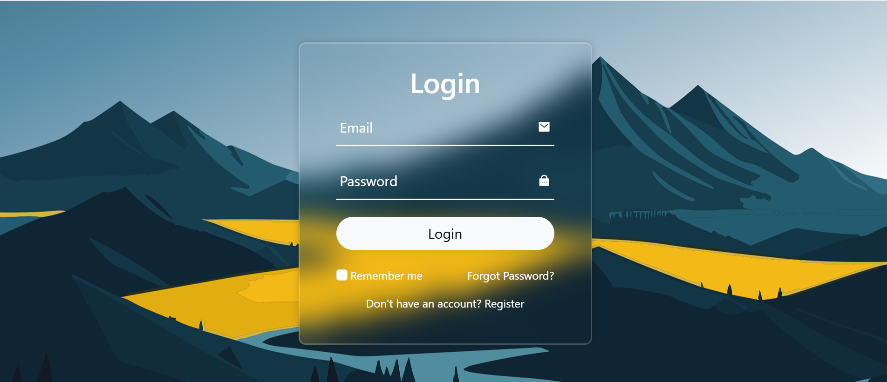
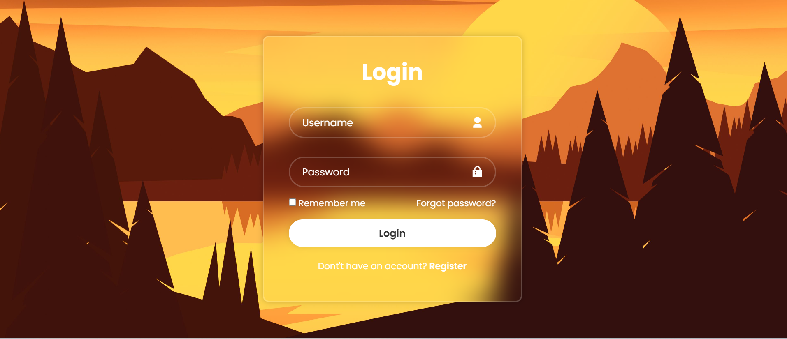
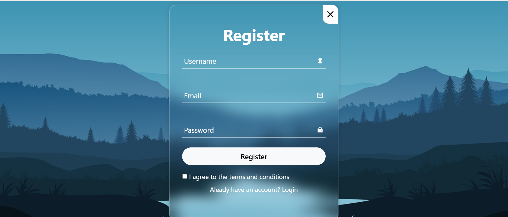

Login & Register UI Project

This project is a simple frontend design of Login and Register pages built using HTML and CSS. It focuses on UI/UX design only and does not include backend or authentication functionality.

Features

* Clean Login page design
* Alternative Login UI design
* Register page UI
* Responsive and modern glassmorphism design

Technologies Used

* HTML5
* CSS3

📂 Project Structure

* `index1.html` – Login page
* `index2.html` – Alternative Login page
* `index3.html` – Register page
* `style.css` – Styling file
* `images/` – Background images
* `screenshots/` – UI previews

📸 Screenshots

Login Page

Alternative Login Design

Register Page

How to Run

1. Download or clone this repository
2. Open `index.html` in any browser
3. Navigate between Login and Register pages using links

 Note

This project is for learning and UI practice purposes only. No backend or authentication system is implemented.
